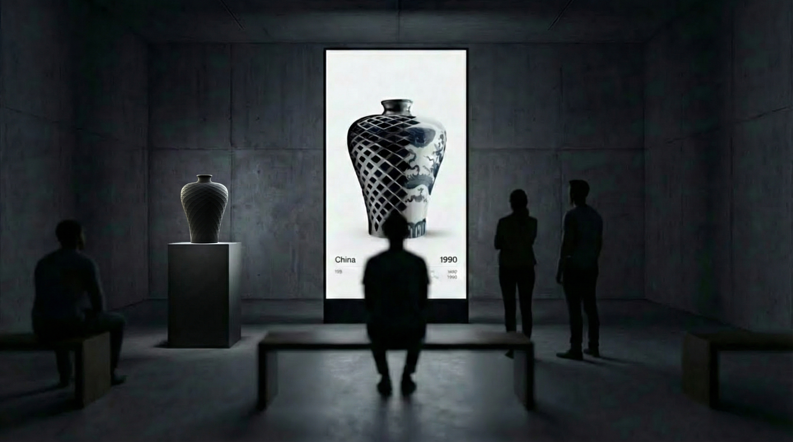
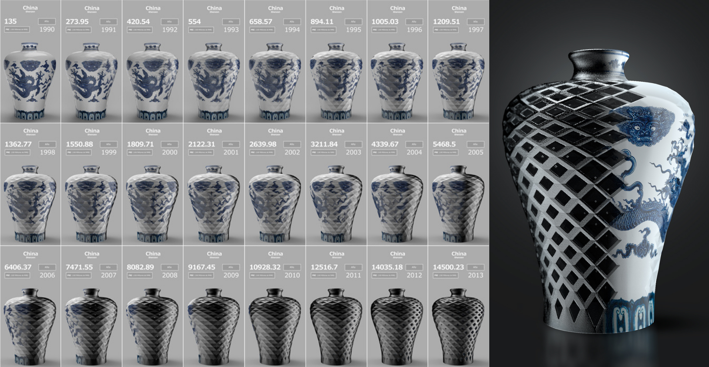
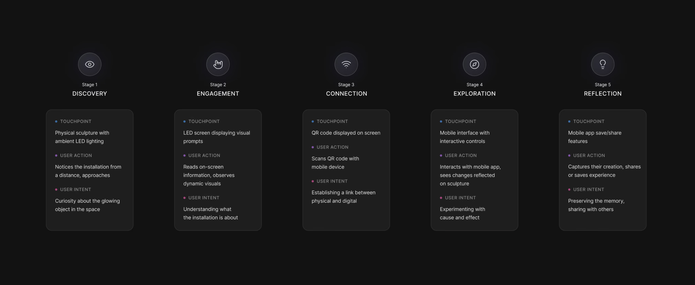

# **From Ming to Chip \- Binary Craft**

An interactive data visualization sculpture that explores the transformation of Shenzhen (China) from an artisanal powerhouse to a global technological hub.

<video controls src="assets/Ming2Chip.mp4" title="Title"></video>

## **Project Overview**

This project uses the iconic form of a **Ming Vase** as a canvas to represent the GDP growth of Shenzhen between 1990 and 2013\. The piece bridges the gap between traditional craftsmanship and modern industrial might through a synchronized physical and digital interface.





### **Key Components**

* **Digital Sculpture:** Parametrically generated using historical GDP data.  
* **Fabrication:** 3D printed (FDM) in PLA (approx. 50-hour print time).  
* **Interactivity:** Real-time synchronization between a mobile interface, an LED display, and a physical rotating base.

## **Tech Stack**

* **Runtime Environment:** [Node.js](https://nodejs.org/) (Hosted on Raspberry Pi).  
* **Communication:** [Socket.io](https://socket.io/) (WebSockets) for low-latency real-time interaction.  
* **Physical Computing:** Raspberry Pi GPIO for Stepper Motor control (NEMA 17 \+ A4988).  
* **Frontend:** HTML5/JavaScript for the Mobile Controller and the LED Visualization.

## **System Architecture**

The project operates as a centralized ecosystem managed by a **Raspberry Pi**:

1. **The Server:** A Node.js backend handles WebSocket traffic and translates degrees of rotation into hardware pulses for the motor.  
2. **Mobile App:** A web-based controller where users scan a QR code to rotate the vase (0° \- 360°).  
3. **LED Visualization:** A high-definition render on a vertical screen that mirrors the physical vase's rotation and displays PBI data points.

## **Installation & Setup**

### **Prerequisites**

* Raspberry Pi (3 or 4 recommended).  
* Node.js installed.  
* Stepper motor driver (e.g., A4988) connected to GPIO.

## Hardware Integration

To bridge the digital and physical worlds, the Raspberry Pi controls a high-torque stepper motor located at the base of the sculpture.

### Motor Logic

The system tracks the current "Step Position" and calculates the shortest path to the new degree requested by the user via the Mobile App.

* **Resolution:** 1.8° per step (enhanced via 1/16 microstepping for silent operation).
* **Sync:** The WebSocket event triggers both the CSS/WebGL rotation in the browser and the GPIO pulses in the motor simultaneously.

### Wiring Diagram Reference

| Component | RPi Pin (Physical) | Function |
|-----------|--------------------|----------|
| A4988 STEP| Pin 11             | Pulse signal |
| A4988 DIR | Pin 13             | Rotation direction |
| A4988 GND | Pin 6              | Common Ground |

### **Running the Project**

1. **Clone the repository:**  

   ```Bash  
   git clone https://github.com/EzequielLasnier/From-Ming-To-Chip.git  
   cd from-ming-to-chip/server
   ```

2. **Install dependencies:**  

   ```Bash  
   npm install
   ```

3. **Start the server:**  

   ```Bash  
   sudo node server.js
   ```

4. **Auto-start:** This project uses PM2 for process management and Chromium in \--kiosk mode for the display.

### **Resumen de etapas**



1. **Encendido:**
La Raspberry Pi arranca y PM2 inicia el servidor.

2. **Visualización:**
El navegador Chromium se abre en pantalla completa mostrando el jarrón digital.

3. **Interacción:**
El usuario escanea el QR, mueve el slider en su móvil, y vía WebSockets, la Raspberry Pi recibe la orden para mover el motor físico y rotar la imagen en la pantalla LED simultáneamente.

## **Data Source**

* **Metric:** GDP in RMB (Triennial data).  
* **Period:** 1990 \- 2013\.  
* **Source:** Data Center, University of Michigan.

## **Authors \- Binary Craft**

* **Santiago Testorelli:** Computer Design & 3D Visualization.  
* **Ezequiel Lasnier:** Production, Hardware & Electronics.
